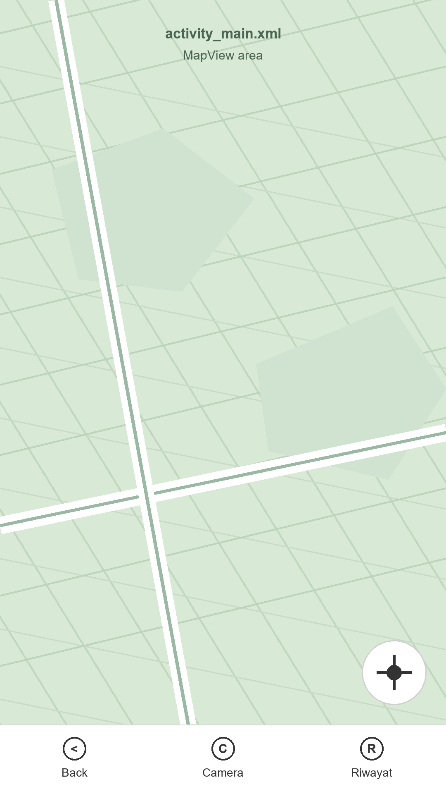
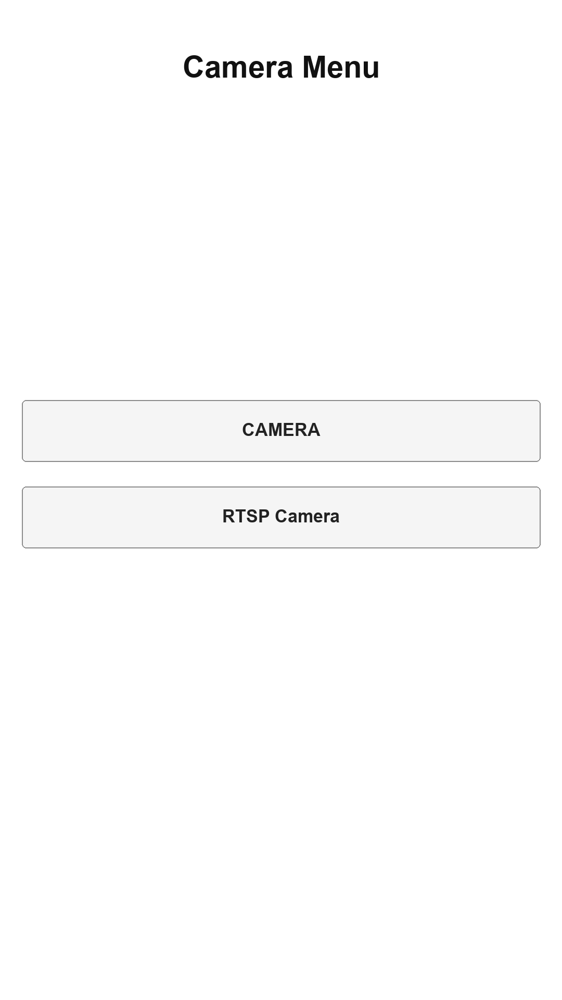

# Street View

Street View adalah aplikasi Android untuk memantau kamera lokal dan kamera RTSP secara langsung. Aplikasi ini dilengkapi tampilan peta, tombol lokasi, riwayat snapshot, dan menu kamera sederhana untuk berpindah antara kamera perangkat dan streaming RTSP.

## Preview UI

| Main Screen | Camera Menu |
| --- | --- |
|  |  |

## Fitur Utama

- Live streaming kamera RTSP.
- Kamera lokal dari perangkat Android.
- Tampilan peta dengan dukungan lokasi pengguna.
- Tombol cepat untuk kembali ke posisi lokasi.
- Riwayat foto atau snapshot.
- Bottom navigation untuk akses Camera, Riwayat, dan Back.

## Teknologi

- Kotlin dan Java
- Android SDK
- Mapbox Maps
- RTSP client library
- Room database
- Material Bottom Navigation

## Struktur Aplikasi

- `MainActivity` menampilkan peta, lokasi, bottom navigation, dan fragment utama.
- `CameraMenuActivity` menampilkan pilihan kamera lokal atau kamera RTSP.
- `LiveFragment` menangani streaming RTSP.
- `LocalCameraFragment` menangani kamera perangkat.
- `HistoryFragment` menampilkan riwayat snapshot.

## Catatan Konfigurasi

Project ini membutuhkan token Mapbox agar peta dan dependency Mapbox dapat berjalan saat build.

Tambahkan token secara lokal melalui environment variable atau Gradle property:

```bash
MAPBOX_DOWNLOADS_TOKEN=your_mapbox_downloads_token
```

Lalu isi access token runtime Mapbox di resource lokal sesuai kebutuhan:

```xml
<string name="mapbox_access_token">your_mapbox_access_token</string>
```

Token sengaja tidak disimpan di repository agar aman.

## Menjalankan Project

1. Clone repository ini.
2. Buka project di Android Studio.
3. Tambahkan token Mapbox lokal.
4. Sync Gradle.
5. Jalankan aplikasi ke emulator atau perangkat Android.

## Repository

Project ini dibuat sebagai aplikasi pemantauan kamera sederhana dengan fokus pada live camera, RTSP streaming, peta lokasi, dan riwayat snapshot.
